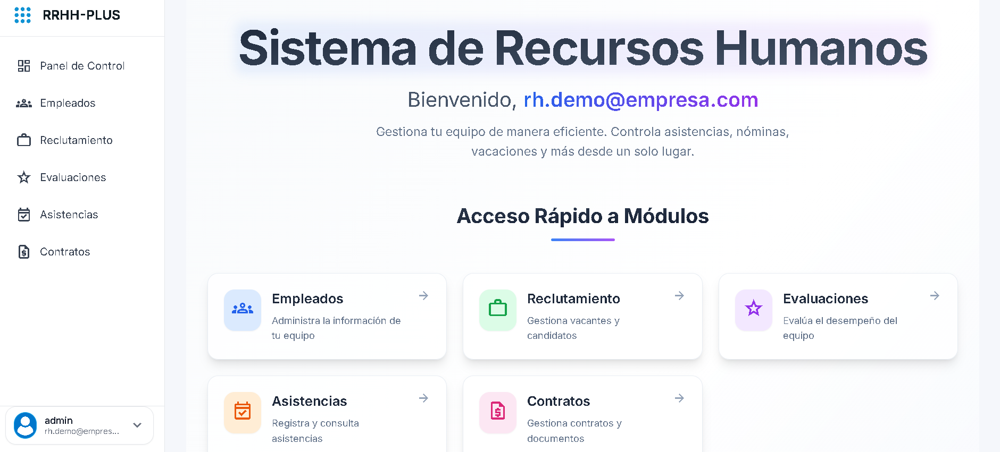
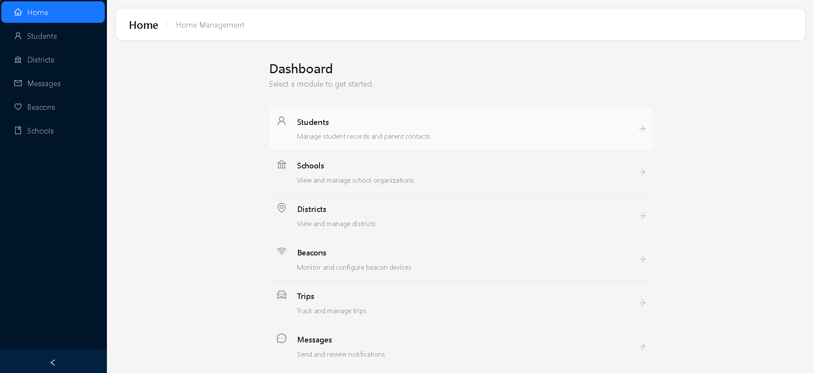

  

  

 

  

 

  <h2>👨‍💻 About Me</h2>

  

 

  
  
  

 

  <marquee behavior="scroll" direction="left" scrollamount="10">
    ⚡ Advanced React patterns &nbsp;&nbsp;•&nbsp;&nbsp; 🏗️ C# design patterns &nbsp;&nbsp;•&nbsp;&nbsp; 🧩 System architecture &nbsp;&nbsp;•&nbsp;&nbsp; 🧹 Clean Code &nbsp;&nbsp;•&nbsp;&nbsp; 🌍 Open Source &nbsp;&nbsp;•&nbsp;&nbsp; 🔁 Code · Learn · Build · Repeat &nbsp;&nbsp;•&nbsp;&nbsp;
  </marquee>

 

  <h2>🛠️ Tech Stack</h2>
  
  <h3>Languages</h3>
  

    
    
    
    
    
  

  
  <h3>Frameworks & Libraries</h3>
  

    
    
    
    
    
  

  
  <h3>Databases</h3>
  

    
    
    
    
  

  
  <h3>Tools & DevOps</h3>
  

    
    
    
    
    
    
  

 

  <h2>🚀 What I'm Up To</h2>

<table align="center">
  <tr>
    <td align="center" width="50%">
      <h3>🎯 Current Focus</h3>
      

        • Building fullstack projects with React & .NET 
        • Mastering Entity Framework Core 
        • Implementing Clean Architecture 
        • Practicing data structures & algorithms 
        • Contributing to open source
      

    </td>
    <td align="center" width="50%">
      <h3>📚 Learning</h3>
      

        • Advanced React patterns (Context, Hooks) 
        • ASP.NET Core Web APIs 
        • SQL Server optimization 
        • Docker containerization 
        • System design fundamentals
      

    </td>
  </tr>
</table>

 

  <h2>📊 GitHub Stats</h2>
  

 

  <h2>💼 Featured Projects</h2>

  <table>
    <tr>
      <td width="50%">
        <h3 align="center">RH Plus — Sistema de Recursos Humanos</h3>
        

          
           
          

            <strong>React • Vite • Tailwind CSS • REST API • JWT</strong> 
            Sistema web para la gestión integral de Recursos Humanos: administración de empleados, control de asistencias, evaluaciones de desempeño y procesos de reclutamiento. 
            <a href="https://system-rrhh-plus.netlify.app/" target="_blank">🔗 Ver demo en vivo</a>
          

        

      </td>
      <td width="50%">
        <h3 align="center">LF Schools</h3>
        

          
           
          

            <strong>React • Ant Design • REST API</strong> 
            Plataforma de gestión escolar para la administración de estudiantes, personal docente, escuelas y distritos, con seguimiento de viajes mediante beacons y notificaciones a padres por SMS, voz y correo.
             
            <a href="https://lf-schools.netlify.app/" target="_blank">🔗 Ver demo en vivo</a>
          

        

      </td>
    </tr>
  </table>

 

  <h2>🤝 Let's Connect</h2>
  
  
  
  

 

  <h2>💭 My Philosophy</h2>
  <table>
    <tr>
      <td>
        
      </td>
    </tr>
  </table>

 

  

---

  <h3>
    
  </h3>

